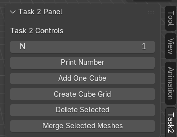
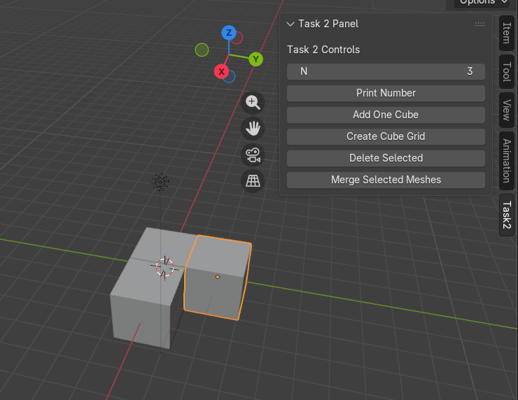
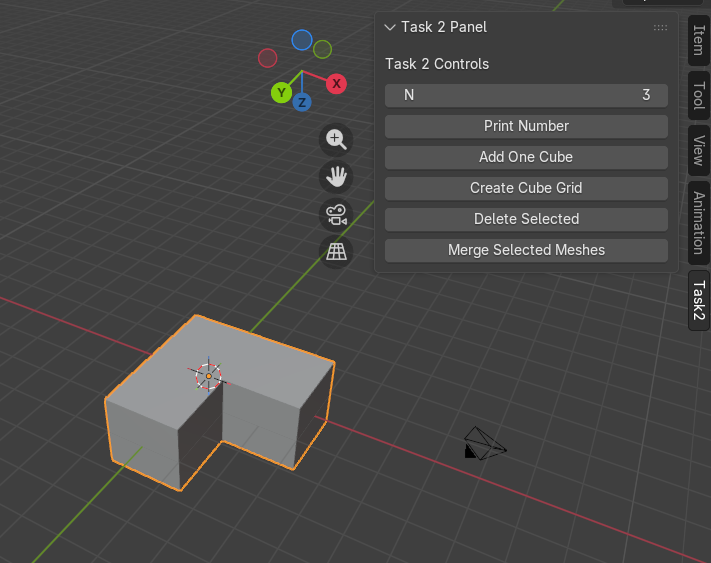

# TASK 2 - Blender Addon

**Author: Sujal Chowdhary**

## Features 
UI Panel

Accessible from: View3D → Sidebar → Task2

The panel includes:
* Number input field (N)
* Print Number button
* Add One Cube button
* Create Cube Grid button
* Delete Selected button
* Merge Selected Meshes button

### Print Number
Prints the value of N to Blender’s system console.

### Add One Cube
Adds a default cube at the current 3D cursor location.

### Create Cube Grid

Creates a grid of cubes based on the value of N.
* Automatically calculates rows and columns
* Maximum allowed value is 20
* Cubes are evenly spaced

If N is greater than 20, an error message is displayed.

### Delete Selected
Deletes all selected objects.

* Automatically switches to Object Mode if required

* Displays a warning if nothing is selected

### Merge Selected Meshes

Merges exactly two selected mesh objects only if they share a face.

Steps performed:

1. Checks that two objects are selected

2. Ensures both are meshes

3. Detects whether they share a face using bounding box overlap tests

4. Joins the objects

5. Removes overlapping vertices

6. Recalculates normals

If any condition fails, Blender shows an error message.

## Installation

Open Blender

Go to Edit → Preferences → Add-ons

Click Install…

Select the Python file containing this add-on

Enable the add-on

## Test Photos

1. Panel Photo

2. Add cube grid

3. Merging the grid

